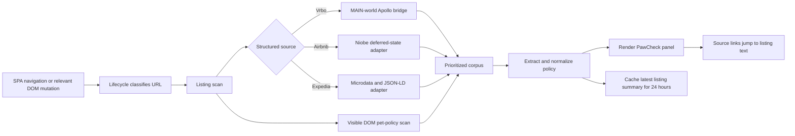
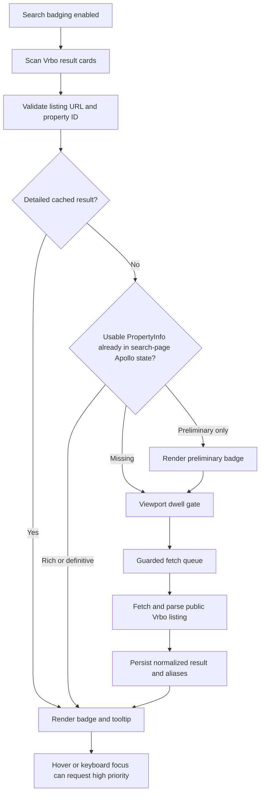

# Development

This repository contains the PawCheck Chrome extension runtime and the release
packaging files. It does not contain the original test suites, browser
automation, demo generators, or other internal tools.

## Requirements

- Chrome 111 or later
- Node.js 20 or later
- The `zip` command-line utility

PawCheck has no runtime or development package dependencies. You can build
the extension without `npm install`.

## Repository layout

- `src/` — Chrome extension runtime and manifest
- `src/content/` — listing panels, search badges, and page integration
- `src/popup/` — toolbar popup
- `src/shared/` — shared extraction, formatting, caching, and request logic
- `src/sites/` — site-specific adapters
- `docs/` — user-facing images referenced by the README
- `store-assets/` — Chrome Web Store artwork and screenshots
- `tools/build-zip.js` — release archive builder

## Runtime architecture

PawCheck is a dependency-free Manifest V3 extension. The manifest loads the
shared registry and extraction modules before it loads the page controllers.
Airbnb and Expedia register their adapters with the shared registry. The
registry contains the built-in Vrbo site. `content/content.js` connects the
lifecycle, listing-panel, and search-badge modules. The controller contains no
site-specific parsing logic.

The main runtime responsibilities are:

- `content/lifecycle.js` — tracks SPA navigation, DOM mutations, extension
  invalidation, and access to `chrome.storage.local`
- `shared/site-registry.js` — classifies URLs, extracts property IDs, and
  exposes each site's structured-data and DOM-section configuration
- `content/pdp-panel.js` — scans listing pages, combines sources, renders the
  policy panel, and implements source jumps
- `shared/extract.js` — builds the prioritized policy corpus, extracts policy
  fields, identifies contradictions, and normalizes the result
- `content/search-badges.js` — discovers Vrbo search cards and manages badges,
  viewport gating, tooltips, and queue subscriptions
- `shared/search-fetcher.js`, `shared/search-cache.js`, and
  `shared/backoff-ladder.js` — control search-result requests, caching,
  request intervals, request limits, and recovery after server pressure

### Listing-page pipeline

The three supported sites use the same normalized policy format. Each site
supplies listing data differently.

| Site | Structured source | Adapter behavior |
| --- | --- | --- |
| Vrbo | `window.__APOLLO_STATE__` | `content/page-bridge.js` runs in the page's MAIN world. It reads the current `PropertyInfo` graph and sends text to the isolated content script through `paw-apollo-data` events. |
| Airbnb | `#data-deferred-state-0` | `sites/airbnb/adapter.js` parses the Relay/GraphQL `niobeClientData` JSON from the DOM. It keeps long numeric listing IDs as strings. |
| Expedia | Microdata and JSON-LD | `sites/expedia/adapter.js` reads `meta[itemprop="petsAllowed"]` and matching `FAQPage` answers. |

Each site also uses a visible-DOM fallback. This fallback labels each text item
with the nearest identified section. Source buttons use this label to open the
applicable listing text.



If the first scan finds no policy data, `pdp-panel.js` starts a second DOM
scan. It also starts this scan when the user requests a rescan. This scan opens
applicable **Show more** controls and collects text from the dialogs. PawCheck
temporarily mounts possible lazy sections. Then, it restores the page.
PawCheck ignores the DOM mutations from this work. This prevents an unwanted
rescan loop.

`buildCorpus()` divides source text into policy sentences. It removes text
that is not applicable to dogs or pets. It removes duplicate text and keeps
the source with the highest priority. Pets rows have a higher priority than
House Rules, property descriptions, and visible-page fallback text.
`extractPolicy()` then finds permission, dog count, weight, fees, deposits,
approval requirements, and other notes. It keeps conflicting values as
alternatives.

Before PawCheck shows the result, it normalizes the policy. Search badges and
the toolbar popup use the same policy format. Before asynchronous expansion,
the scan records the page URL. If SPA navigation changes the URL during the
scan, PawCheck discards the result. It does not show the result on the next
property.

### Vrbo search badging

Search badging is experimental and operates only on Vrbo. It starts only when
these conditions are true:

- The current URL is a registered Vrbo search route.
- `paw_enable_search_badging` is `true` in local extension storage.

The Airbnb and Expedia adapters return `false` from `isSearchUrl()`. Thus, the
search pipeline does not start on these sites.



PawCheck tracks cards by property ID. Vrbo reuses DOM nodes during SPA
updates. When Vrbo reuses or removes a card, PawCheck removes its subscription,
dwell timer, and queued work. Duplicate cards for one property use the same
cached result and queue subscription.

The search-page Apollo fast path asks `page-bridge.js` for a maximum of 40
`PropertyInfo` records. Vrbo already loaded these records. PawCheck can show a
definitive policy without a property-page request. PawCheck can immediately
show a preliminary policy. A later listing request can replace this policy
with more information.

### Search-traffic mitigations

These controls reduce traffic and respond to server pressure. They do not
remove all risk from this experimental feature. Vrbo can throttle or challenge
the browser. Therefore, badging is off by default. Use badging only when it is
necessary.

| Mitigation | Current behavior |
| --- | --- |
| Explicit opt-in | PawCheck starts search badging only when the user enables the toolbar setting. |
| Search-page fast path | PawCheck uses Vrbo Apollo records from the search page before it makes a listing request. |
| Visibility and dwell gate | A card must enter the observer margin and stay there for 400–600 ms. PawCheck then queues background work. |
| Off-screen pruning | PawCheck removes queued work when a card leaves the viewport, disappears, or Vrbo reuses it. PawCheck lets active requests finish. |
| Scroll gate | PawCheck pauses background requests above 150 px/s. It resumes them after scrolling stops for 150 ms. Hover or keyboard-focus requests can continue. |
| Concurrency | PawCheck runs a maximum of two listing requests at one time. |
| Session limit | PawCheck permits a maximum of 40 background requests in one search-page session. A high-priority user request can exceed this limit. |
| Request intervals | The minimum background interval is 800 ms. The minimum high-priority interval is 250 ms. Random adjustment only increases the interval. |
| Adaptive backoff | Server pressure increases background intervals through 800, 1600, and 3200 ms. It increases high-priority intervals through 250, 500, and 1000 ms. |
| Hard-block response | If PawCheck receives HTTP 429 or HTTP 403, it pauses requests for 30 seconds. It does the same when it finds a challenge. It also increases the backoff level. |
| Soft-failure response | Three timeouts, network errors, or 5xx responses in 60 seconds increase the backoff level. A 60-second period without errors starts recovery. |
| Timeout | PawCheck cancels a listing request after 6 seconds. |
| Cache and duplicate control | A 24-hour persistent cache and a 250-entry memory cache prevent repeat requests. Canonical-ID aliases and queue checks provide more duplicate control. |
| Terminal cooldown | PawCheck applies a short wait after rate-limit, session-limit, timeout, and error states. The wait prevents an immediate retry. |
| Hidden-tab gate | When the document is hidden, PawCheck does not start a queued request. |
| Local-only instrumentation | PawCheck keeps search counters in memory for debugging. It does not store or transmit these counters. |

The user's browser sends search-result requests directly to Vrbo. These
requests use the existing Vrbo session. PawCheck does not send requests through
an intermediate server. PawCheck does not send results, browsing activity, or
diagnostic data to the developer.

## Load the extension locally

1. Open `chrome://extensions` in Chrome.
2. Enable **Developer mode**.
3. Select **Load unpacked**.
4. Choose this repository's `src/` directory.
5. If you change runtime files, select **Reload** on the PawCheck extension
   card.
6. Refresh the page that you want to test.

## Validate runtime JavaScript

Before packaging, run the Node.js syntax check on the runtime:

```sh
find src -name '*.js' -print0 | xargs -0 -n1 node --check
```

Then, test the extension on supported listing pages. Make sure that the
listing summary, source links, popup, theme, and optional Vrbo search badges
operate correctly.

## Build a release

```sh
npm run build
unzip -t dist/pawcheck-v1.0.1.zip
```

The builder reads the product name and version from `src/manifest.json`. It
creates `dist/pawcheck-vX.Y.Z.zip`. The archive root contains the files from
`src/`. Chrome requires this layout.

Git ignores the `dist/` directory and ZIP archives.

## Prepare a new version

1. Update `version` in `src/manifest.json`.
2. Update `version` in `package.json` to match.
3. Add the release entry to `CHANGELOG.md`.
4. Update any version-specific filenames in the documentation.
5. Run the syntax check.
6. Test the unpacked extension.
7. Build the archive.
8. Run `unzip -t` on the archive.
9. Commit the release.
10. Create the matching `vX.Y.Z` Git tag.
11. Attach the ZIP archive to the GitHub release.

## Privacy-sensitive changes

If permissions, host access, storage, or network behavior change, update
`PRIVACY.md`. Do not add telemetry or transmit user browsing data without an
approved product decision. Update the privacy policy before you release such
a change.
