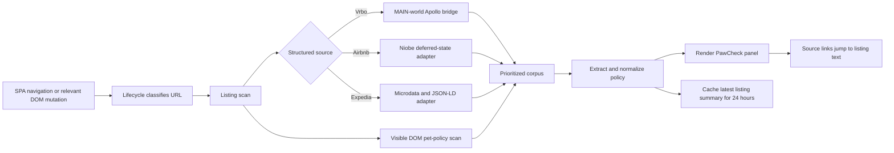

# Development

This repository contains the PawCheck Chrome extension runtime and the files
needed to package a release. It does not include the original test suites,
browser automation, demo generators, or other internal tooling.

## Requirements

- Chrome 111 or later
- Node.js 20 or later
- The `zip` command-line utility

PawCheck has no runtime or development package dependencies. You do not need
to run `npm install` to build the extension.

## Repository layout

- `src/` — Chrome extension runtime and manifest
- `src/content/` — listing panels, search badges, and page integration
- `src/popup/` — toolbar popup
- `src/shared/` — shared extraction, formatting, caching, and request logic
- `src/sites/` — site-specific adapters
- `docs/` — user-facing images referenced by the README
- `store-assets/` — Chrome Web Store artwork and screenshots
- `tools/build-zip.js` — release archive builder

## Runtime architecture

PawCheck is a dependency-free Manifest V3 extension. The manifest loads the
shared registry and extraction modules before the page controllers. Airbnb
and Expedia then register their adapters with the shared registry; Vrbo is
the registry's built-in site. `content/content.js` connects the lifecycle,
listing-panel, and search-badge modules without putting site-specific parsing
logic in the controller.

The main runtime responsibilities are:

- `content/lifecycle.js` — tracks SPA navigation, DOM mutations, extension
  invalidation, and safe access to `chrome.storage.local`
- `shared/site-registry.js` — classifies URLs, extracts property IDs, and
  exposes each site's structured-data and DOM-section configuration
- `content/pdp-panel.js` — scans listing pages, combines sources, renders the
  policy panel, and implements source jumps
- `shared/extract.js` — builds the prioritized policy corpus, extracts policy
  fields, resolves contradictions, and normalizes the result
- `content/search-badges.js` — discovers Vrbo search cards and manages badges,
  viewport gating, tooltips, and queue subscriptions
- `shared/search-fetcher.js`, `shared/search-cache.js`, and
  `shared/backoff-ladder.js` — own search-result requests, caching, pacing,
  request budgets, and pressure recovery

### Listing-page pipeline

All three supported sites produce the same normalized policy shape, but they
do not expose listing data the same way.

| Site | Structured source | Adapter behavior |
| --- | --- | --- |
| Vrbo | `window.__APOLLO_STATE__` | `content/page-bridge.js` runs in the page's MAIN world, walks the current `PropertyInfo` graph, and sends text items to the isolated content script through `paw-apollo-data` events. |
| Airbnb | `#data-deferred-state-0` | `sites/airbnb/adapter.js` parses the Relay/GraphQL `niobeClientData` JSON directly from the DOM and keeps long numeric listing IDs as strings. |
| Expedia | Microdata and JSON-LD | `sites/expedia/adapter.js` reads `meta[itemprop="petsAllowed"]` and matching `FAQPage` answers. |

Every site also uses a visible-DOM fallback. The fallback labels snippets with
the nearest recognized section so source buttons can take the user back to
the relevant listing text.



`pdp-panel.js` performs a second, best-effort DOM pass when the first pass
finds no policy data or the user requests a rescan. That pass expands relevant
"show more" controls, harvests text from dialogs it opened, briefly mounts
likely lazy sections, and restores the page afterward. Mutations caused by
this work are suppressed so PawCheck does not trigger its own rescan loop.

`buildCorpus()` splits source text into policy-sized sentences, filters mixed
sections for dog/pet relevance, and de-duplicates identical text while keeping
the highest-priority source. Dedicated Pets rows rank above House Rules,
property descriptions, and visible-page fallback text. `extractPolicy()` then
derives allowance, dog count, weight, fees, deposits, approval requirements,
and other notes. Conflicting values remain attached as alternates instead of
being silently discarded.

Before rendering, the policy is normalized into the same schema used by
search badges and the toolbar popup. A scan records the page URL before any
asynchronous expansion; if an SPA navigation changes the URL while the scan
is running, the result is discarded rather than shown on the next property.

### Vrbo search badging

Search badging is an experimental, Vrbo-only feature. It starts only when the
current URL is a registered Vrbo search route and
`paw_enable_search_badging` is `true` in local extension storage. Airbnb and
Expedia adapters return `false` from `isSearchUrl()`, so the search pipeline
cannot activate on those sites.


Cards are tracked by property ID because Vrbo recycles DOM nodes during SPA
updates. A recycled or detached card has its subscription, dwell timer, and
queued work removed. Duplicate cards for the same property share the cached
result and queue subscription.

The search-page Apollo fast path asks `page-bridge.js` for at most 40
`PropertyInfo` records that Vrbo has already loaded. A concrete answer can
render without a property-page request. A shallow answer can render
immediately but still allows a later listing fetch to replace it with richer
data.

### Search-traffic mitigations

These controls reduce traffic and react to server pressure; they do not make
the experimental feature risk-free. Vrbo can still throttle or challenge the
browser, which is why badging remains off by default and should be used
sparingly.

| Mitigation | Current behavior |
| --- | --- |
| Explicit opt-in | Search badging runs only when the toolbar setting is enabled. |
| Search-page fast path | Reuses Vrbo Apollo records already present on the search page before considering a listing request. |
| Visibility and dwell gate | A card must enter the observer margin and remain there for 400–600 ms before background work is queued. |
| Off-screen pruning | Queued work is removed when a card leaves the viewport, is recycled, or disappears from the DOM. In-flight requests are allowed to finish. |
| Scroll gate | Background dispatch pauses above 150 px/s and resumes after 150 ms of settled scrolling. Explicit hover/focus work remains responsive. |
| Concurrency | At most two listing requests run at once. |
| Session budget | Background traffic is capped at 40 dispatched requests per search-page session. Explicit high-priority user lookups may bypass the background cap. |
| Dispatch pacing | Background requests start at an 800 ms floor; the shared high-priority floor is 250 ms. One-sided jitter only adds delay. |
| Adaptive backoff | Pressure raises pacing through 800, 1600, and 3200 ms background steps. High-priority floors rise through 250, 500, and 1000 ms. |
| Hard-block response | HTTP 429, HTTP 403, or a detected challenge pauses dispatch for 30 seconds and raises the backoff level. |
| Soft-failure response | A cluster of three timeouts, network errors, or 5xx responses within 60 seconds raises the backoff level. Recovery requires a clean 60-second window. |
| Timeout | A listing request is aborted after 6 seconds. |
| Cache and de-duplication | A 24-hour persistent cache, a 250-entry in-memory LRU, canonical-ID aliases, and synchronous queue de-duplication avoid repeat requests. |
| Terminal cooldown | Rate-limited, capped, timeout, and error states receive a short cooldown so repeated scans do not immediately retry them. |
| Hidden-tab gate | The queue does not dispatch while the document is hidden. |
| Local-only instrumentation | Search counters are held in memory for debugging and are never persisted or transmitted. |

Search-result requests go directly from the user's browser to Vrbo and use the
browser's existing Vrbo session. PawCheck does not proxy these requests or
send results, browsing activity, or diagnostics to the developer.

## Load the extension locally

1. Open `chrome://extensions` in Chrome.
2. Enable **Developer mode**.
3. Select **Load unpacked**.
4. Choose this repository's `src/` directory.
5. After changing runtime files, select **Reload** on the PawCheck extension
   card and refresh the page being checked.

## Validate runtime JavaScript

Run Node's syntax checker across the runtime before packaging:

```sh
find src -name '*.js' -print0 | xargs -0 -n1 node --check
```

Then verify the extension manually on supported listing pages. Confirm that
the listing summary, source links, popup, theme, and optional Vrbo search
badges behave as expected.

## Build a release

```sh
npm run build
unzip -t dist/pawcheck-v1.0.1.zip
```

The builder reads the product name and version from `src/manifest.json` and
creates `dist/pawcheck-vX.Y.Z.zip`. The archive root contains the contents of
`src/`, which is the layout Chrome expects.

The `dist/` directory and ZIP archives are intentionally ignored by Git.

## Prepare a new version

1. Update `version` in `src/manifest.json`.
2. Update `version` in `package.json` to match.
3. Add the release entry to `CHANGELOG.md`.
4. Update any version-specific filenames in the documentation.
5. Run the syntax check and manually verify the unpacked extension.
6. Build the archive and run `unzip -t` against it.
7. Commit the release, create the matching `vX.Y.Z` Git tag, and attach the
   ZIP archive to the GitHub release.

## Privacy-sensitive changes

Keep `PRIVACY.md` aligned with any changes to permissions, host access,
storage, or network behavior. PawCheck must not add telemetry or transmit
user browsing data without a clear product decision and an updated policy.
