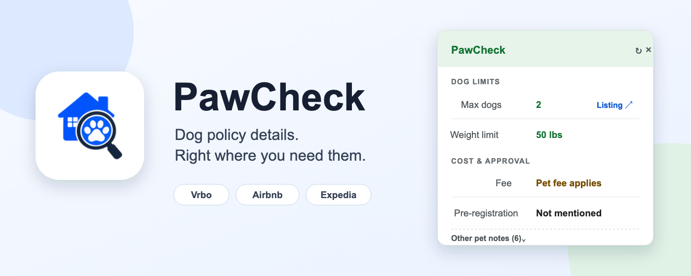
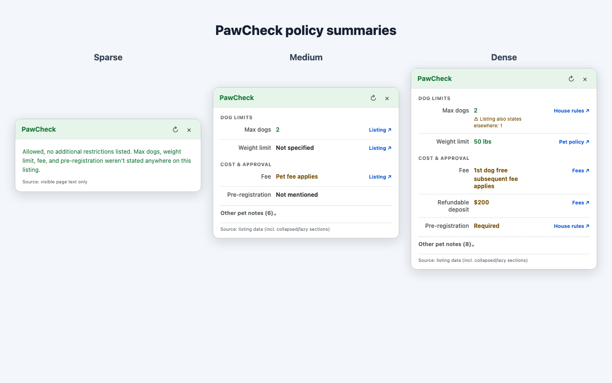
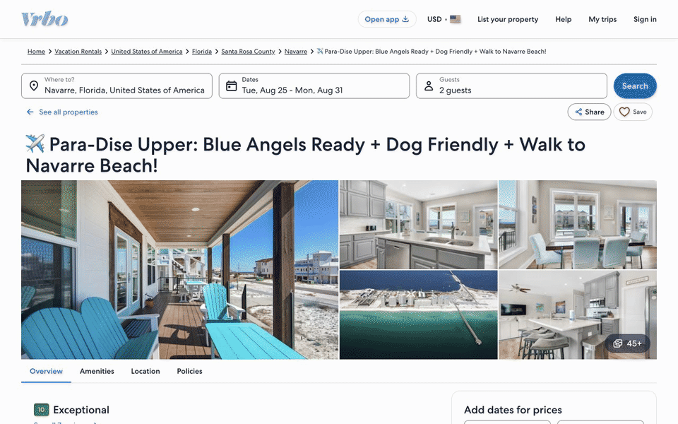
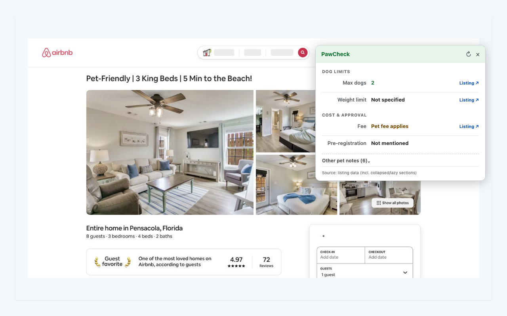
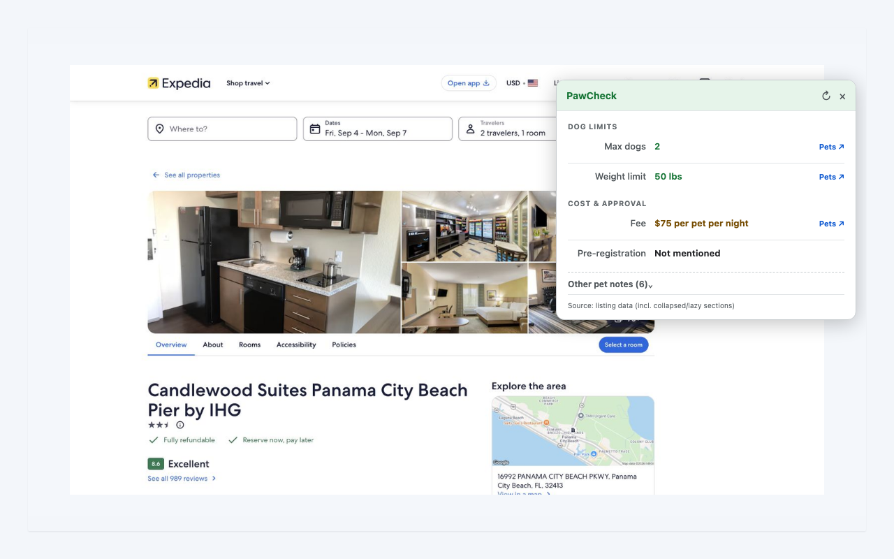

# PawCheck: Dog Policy Callout

PawCheck finds the dog-policy details buried in Vrbo, Airbnb, and Expedia
listings and puts them in a compact summary beside the property.

## Why

Booking sites do not present pet policies in a consistent place. Hosts may
put restrictions in house rules, amenities, property descriptions, policy
sections, or structured page data. Rules can also conflict within the same
listing.

A property marked as pet-friendly may still limit dog count, weight, breed,
or require fees and prior approval. PawCheck gathers those details so you do
not have to search every section manually.

## What PawCheck shows

When you open a supported listing, PawCheck reads the available pet-policy
data and displays an on-page summary containing:

- Whether dogs are allowed
- Maximum dog count and weight limits
- Pet fees and refundable deposits
- Registration or prior-approval requirements
- Other guidelines, including leash or breed restrictions

Source links jump to the corresponding listing text when possible. PawCheck
also warns when sections contain contradictory rules, supports light and dark
themes, and can add optional dog-policy badges to Vrbo search results.

Listings contain different amounts of usable policy information. PawCheck
adapts its summary from a short confirmation to a detailed breakdown without
filling unknown fields with noise.

## Listing examples

### Vrbo listing

### Vrbo search results

Search badges are off by default. To enable them, open PawCheck from the
Chrome toolbar and turn on **Enable search listings badges**. While enabled,
PawCheck fetches public property pages directly from Vrbo as search results
load so it can summarize each listing's dog policy.

### Airbnb

### Expedia

## Install a release

1. Download the latest `pawcheck-v*.zip` from
   [GitHub Releases](https://github.com/curdriceaurora/pawcheck/releases/latest).
2. Unzip the archive.
3. Open `chrome://extensions` in Chrome.
4. Enable **Developer mode**.
5. Select **Load unpacked** and choose the unzipped folder.

## Supported pages

PawCheck supports property listing pages on Vrbo, Airbnb, and Expedia. Search
result badging is currently available on Vrbo only.

PawCheck is independent software and is not affiliated with or endorsed by
Vrbo, Airbnb, Expedia, or their parent companies. Always verify the original
property rules before booking.

- [Release notes](CHANGELOG.md)
- [Development guide](DEVELOPMENT.md)
- [Privacy policy](PRIVACY.md)
- [MIT license](LICENSE)
