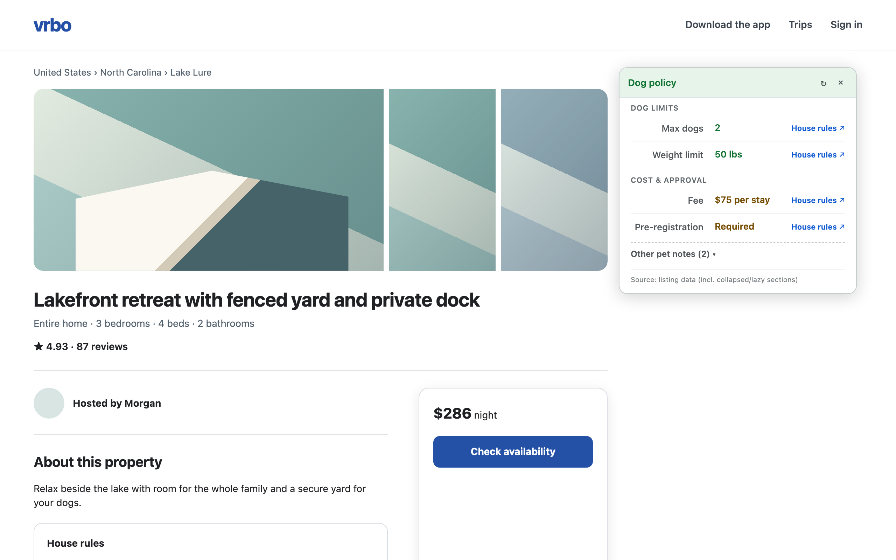

# PawCheck: Dog Policy Callout

PawCheck is a Chrome extension that finds dog-policy details on Vrbo, Airbnb,
and Expedia listings and presents them in a compact summary.

## Why?

Booking sites do not present pet policies in a consistent place. Hosts may
put restrictions in house rules, amenities, property descriptions, policy
sections, or structured page data. Rules can also conflict within the same
listing.

A property marked as pet-friendly may still limit dog count, weight, breed,
or require fees and prior approval. PawCheck gathers those details so you do
not have to search every section manually.

## What

When you open a supported listing, PawCheck reads the available pet-policy
data and displays an on-page summary containing:

- Whether dogs are allowed
- Maximum dog count and weight limits
- Pet fees and refundable deposits
- Registration or prior-approval requirements
- Other guidelines, including leash or breed restrictions

Source links jump to the corresponding listing text when possible. PawCheck
also warns when sections contain contradictory rules, supports light and dark
themes, and can add optional dog-policy badges to Vrbo search results.

## Listing examples

### Vrbo

### Airbnb

### Expedia

## Install a release

1. Download `pawcheck-v1.0.0.zip` from
   [GitHub Releases](https://github.com/curdriceaurora/pawcheck/releases).
2. Unzip the archive.
3. Open `chrome://extensions` in Chrome.
4. Enable **Developer mode**.
5. Select **Load unpacked** and choose the unzipped folder.

When loading a source checkout instead, choose its `src/` directory. The
repository root does not contain the extension manifest.

## Supported pages

PawCheck supports property listing pages on Vrbo, Airbnb, and Expedia. Search
result badges are available on Vrbo and are disabled by default.

PawCheck is independent software and is not affiliated with or endorsed by
Vrbo, Airbnb, Expedia, or their parent companies. Always verify the original
property rules before booking.

- [Release notes](CHANGELOG.md)
- [Development guide](DEVELOPMENT.md)
- [Privacy policy](PRIVACY.md)
- [MIT license](LICENSE)
